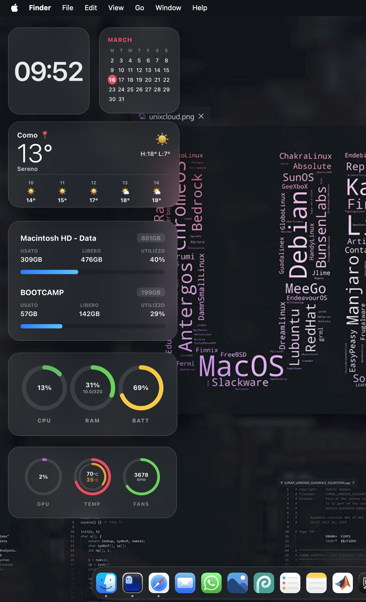

# Glassmorphism Widgets for Übersicht
# Matteo Savoia 2026

A minimalist glass-style widget set featuring a high-impact clock and system stats.

## Preview

## Installation
1. Download the `.coffee` files.
2. Place them in your Übersicht widgets folder.
3. For system stats (Fans & Temp) on Intel Macs, run:
   `sudo chmod +s /usr/bin/powermetrics`

## Credits
- Font: [Anton](https://fonts.google.com/specimen/Anton)
- Tested on: MacBook Pro 16,1 (Intel)
